# Projeto CRUD com React - parte 2

Este é um projeto de gerenciamento de séries assistidas, feita com React para a Disciplina de Desenvolvimento Frontend do curso de Análise e Desenvolvimento de Sistemas - FullStack.

## Tecnologias utilizadas:

## Parte II:

- Foram reaproveitados os componentes da fase I
- Implementação de rotas com NextJS
- Utilização da biblioteca Material UI para a estilização
- Consumir a API Rest de series fornecida
- Implementação de testes unitários com Jest para os componentes

## Pré requisitos:

- Node.js (versão 18+) e o npm instalados na sua máquina.
  [Download Node.js](https://nodejs.org/en/download)

## 🚀 Como rodar o projeto:

- Clonar o projeto: `git clone https://github.com/brendhaed/projeto-frontend-crud-react-2`
- Entrar na pasta: cd projeto-frontend-fase2
- Instalar dependências: `npm install` ou `yarn`
- Para rodar no servidor: abra o terminal e digite `npm run dev`para NPM ou `yarn dev` para Yarn.
- Para rodar a API: entrar na pasta `cd serieJournal-api` e depois `npm start`para NPM ou `yarn start` para Yarn.

## 📁 Estrutura de Pastas

Resumo da estrutura de pastas principal:

- Em Next.js as pastas são colocadas dentro de app, não precisa de react-router-dom como no react. Cada rota precisa estar dentro de app com um arquivo **page.js** dentro do nome da rota.

- **public:** Armazena arquivos estáticos, como imagens, icons, etc.
- **src/app/components:** Contém todos os componentes React do projeto.
- **src/app/hooks:** Contém os hooks reutilizáveis no projeto.
- **src/app/page.js:** Arquivo na raiz de app, é a página principal do projeto
- **src/app/formulario:** Rota que leva para a página do formulario.
- **src/app/series:** Rota que leva para a página de séries.
- **src/app/sobre:** Rota que leva para a página de sobre.

## Tutorial com imagens:

- Abrir pasta do frontend
  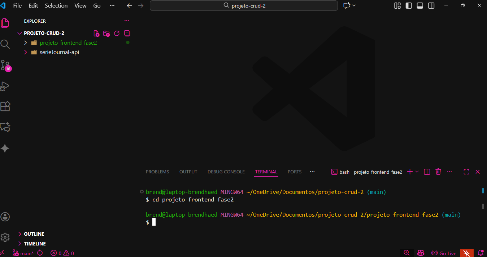
- Rodar projeto no navegador
  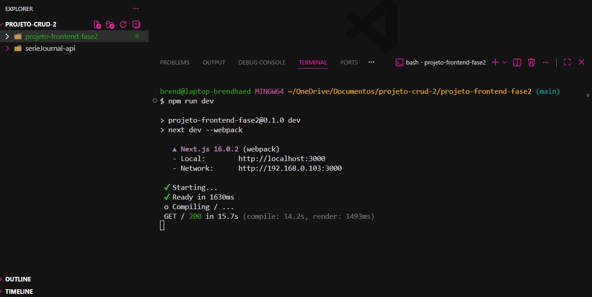
- Abrir pasta da API
  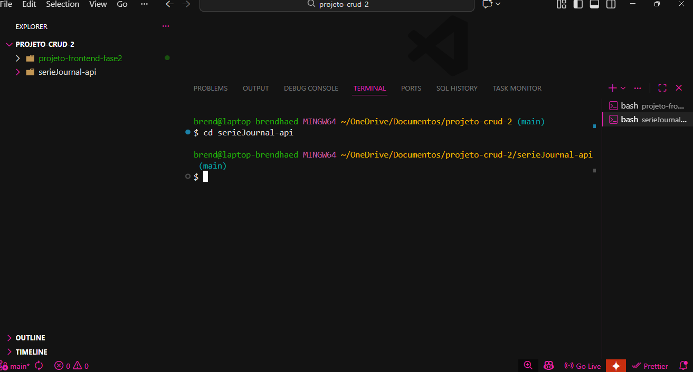
- Rodar api
  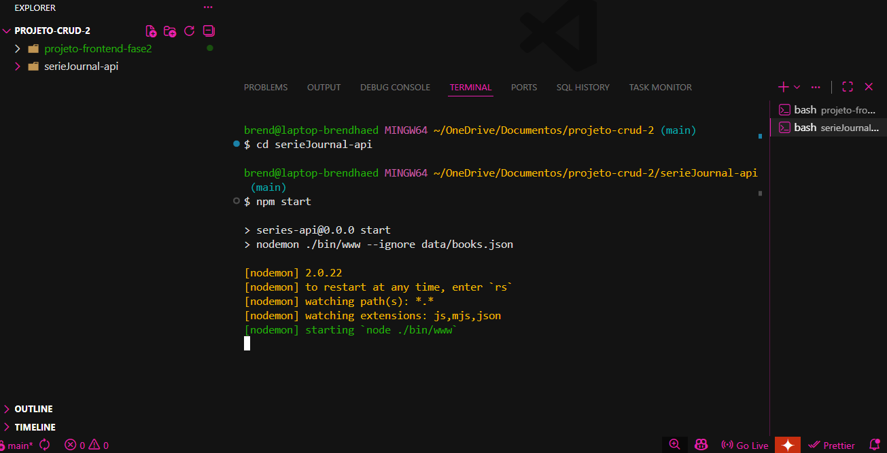
- Como a api deve aparecer no navegador
  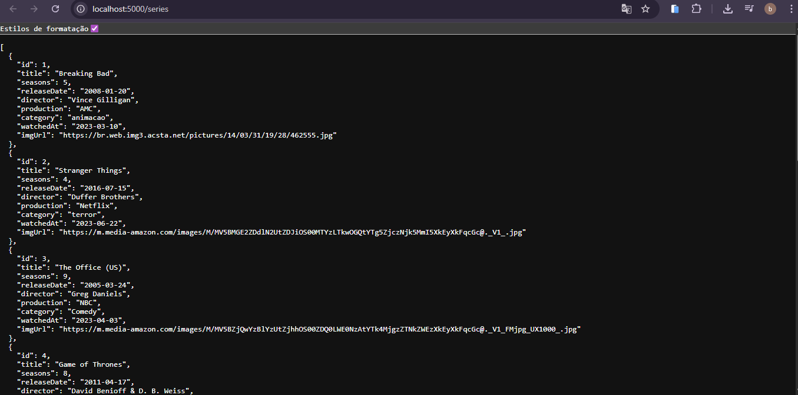
- Página Home
  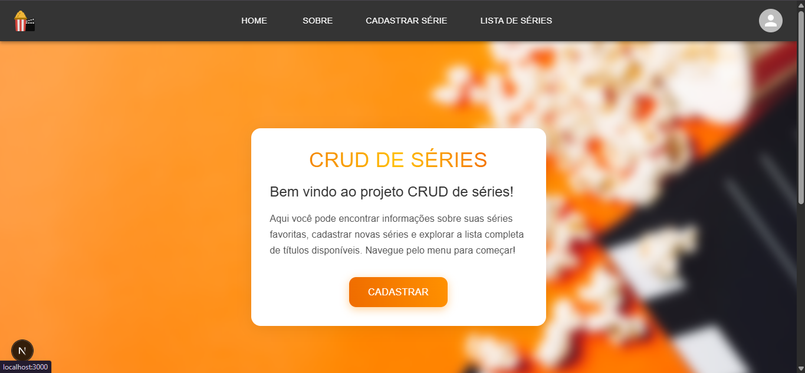
- Página Sobre
  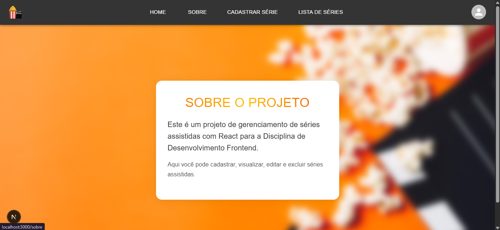
- Página de formulário para cadastrar série
  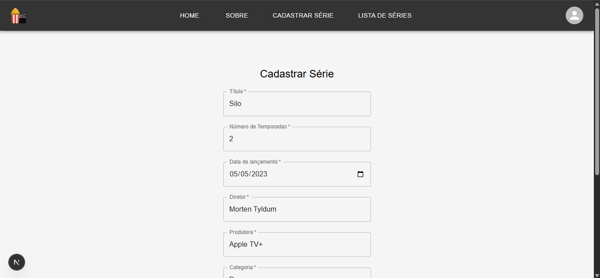
- Enviar série
  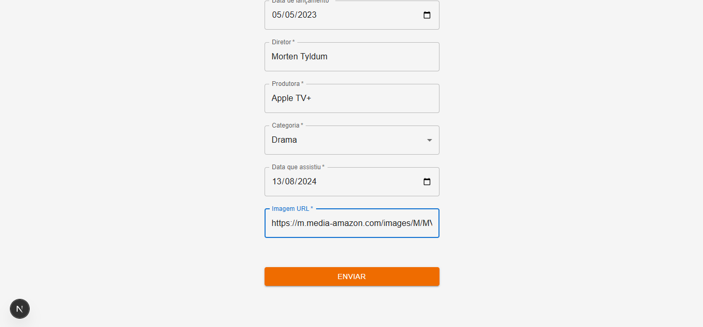
- Página de lista de séries cadastradas
  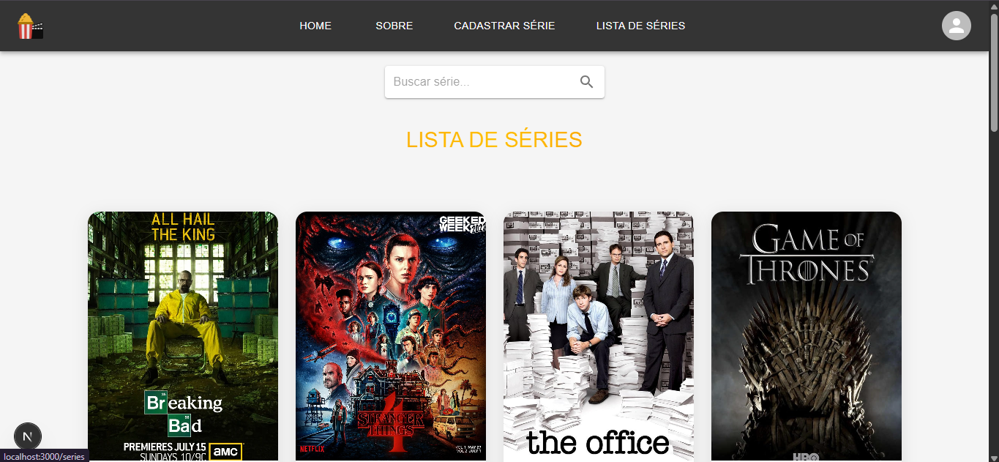
- Excluir série
  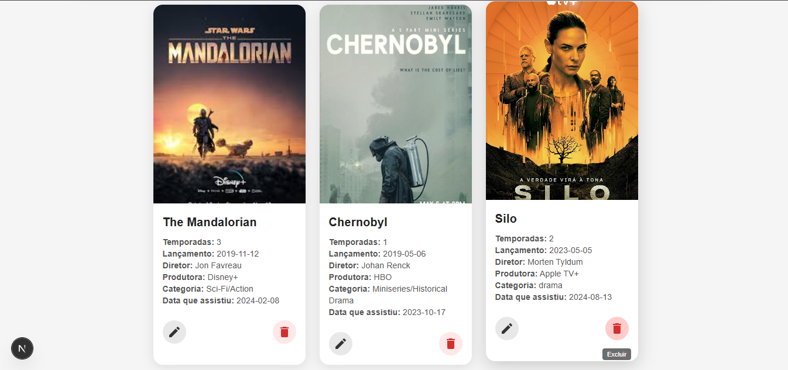
- Editar série
  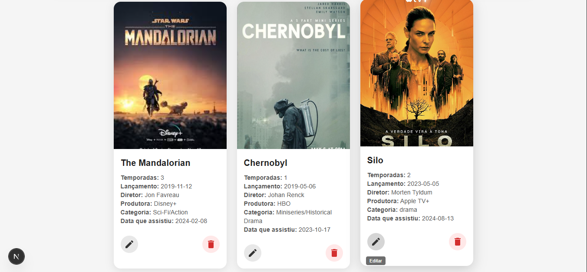
- Editando uma série
  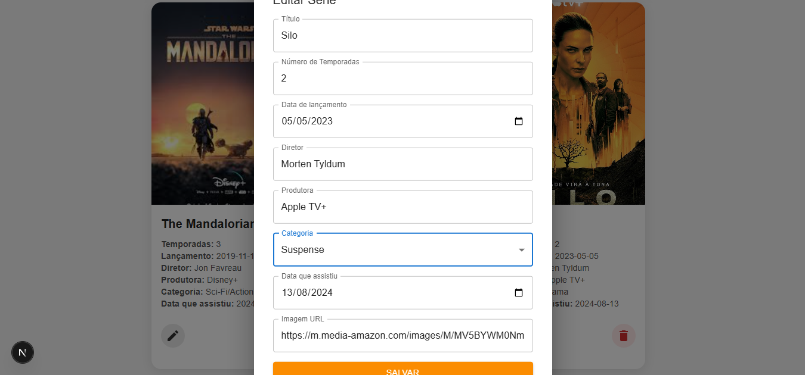
- Buscando uma série
  

  ## Executar os testes:
  - Executar dentro da pasta: projeto-frontend-fase2
  - `npm test`